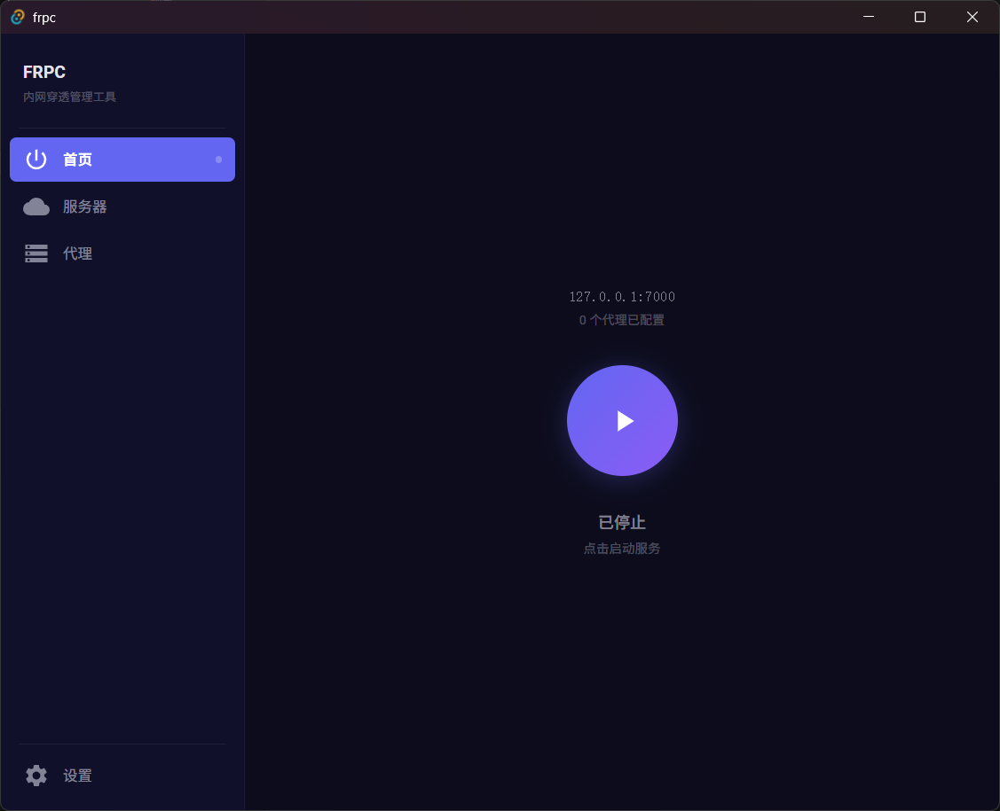

# frpc-app

<div align="center">

**[English](./README_en.md) | 简体中文**

**简洁的 frpc 内网穿透图形化管理工具**


[](https://star-history.com/#wosledon/frpc-app&Timeline)

</div>

---



## 功能

| 模块       | 说明                                                                    |
| ---------- | ----------------------------------------------------------------------- |
| **首页**   | 一键启动 / 停止 frpc 服务，实时显示运行状态、服务器信息、已配置代理数量 |
| **服务器** | 配置 frps 服务器地址（server_addr）和认证令牌（auth_token）             |
| **代理**   | 可视化管理 TCP / HTTP 代理，支持添加、编辑、删除操作                    |
| **设置**   | frpc 二进制状态检测、中英语言切换、深浅主题切换、开机自启配置           |

## 特性

- **跨平台**：Windows / Linux
- **便携化**：数据（frpc 二进制 + 配置文件）存放于可执行文件同级 `data/` 目录，**不依赖 AppData**
- **双主题**：深色（默认）/ 浅色模式
- **双语**：中文 / English
- **系统托盘**：最小化至托盘运行，托盘菜单含「显示窗口」与「退出」
- **固定窗口**：锁定窗口大小，防止布局被误调整

## 快速开始

### 前置条件

- Node.js ≥ 18
- Rust ≥ 1.70
- npm

### 安装与运行

```bash
# 克隆仓库
git clone https://github.com/wosledon/frpc-app.git
cd frpc-app

# 安装依赖
npm install

# 启动开发模式
npm run tauri dev

# 生产构建
npm run tauri build
```

### 使用说明

1. 从 [frp Releases](https://github.com/fatedier/frp/releases) 下载对应平台的 frpc 二进制
2. 将 `frpc.exe`（Windows）或 `frpc`（Linux/macOS）放入程序目录的 `data/` 文件夹
3. 启动 frpc-app，在「服务器」页面填写 frps 连接信息
4. 在「代理」页面添加需要暴露的内网服务
5. 点击首页「启动服务」按钮运行 frpc

## 技术栈

| 层级     | 技术                           |
| -------- | ------------------------------ |
| 桌面框架 | Tauri v2                       |
| 前端     | React 19 + TypeScript + Vite 7 |
| UI 组件  | Material UI (MUI)              |
| 后端     | Rust                           |
| 构建工具 | Tauri CLI v2                   |

## 项目结构

```
frpc-app/
├── src/                      # React 前端
│   ├── App.tsx               # 主应用组件
│   ├── i18n.ts               # 国际化（中 / 英）
│   └── theme.ts              # MUI 主题配置
├── src-tauri/
│   ├── src/
│   │   ├── lib.rs            # Tauri commands（进程管理、配置读写）
│   │   └── main.rs           # Rust 入口
│   ├── Cargo.toml
│   └── tauri.conf.json
└── docs/images/              # 截图
```

## License

MIT

## 相关项目

- [fatedier/frp](https://github.com/fatedier/frp) — frp 内网穿透项目，本应用基于它工作
